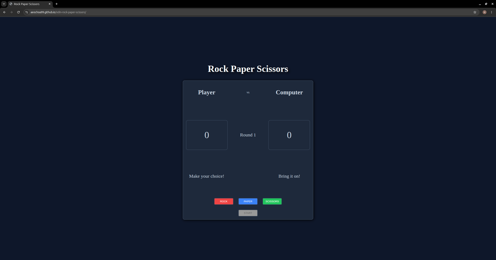

# Odin-Rock-Paper-Scissors

## Description
This is a browser-based Rock, Paper, Scissors game built with HTML, CSS3, and JavaScript. It is a part of The Odin Project Foundations curriculum. This game goes a step above the base requirements of this assignment — instead of a fixed number of rounds, it's played as a first to 3 wins with a max of 5 rounds, with a live scoreboard and round tracker.

## Live Demo
[Play it here!](https://aeochoa99.github.io/odin-rock-paper-scissors/)

## Features
- Player vs. computer, first to 3 points wins the match
- Live scoreboard and round counter
- Tie rounds don't count against either player
- Start / New Game button that fully resets state and button styles
- Buttons disable at the right times (before game start, after game over) so you can't play out of turn

## How to play

1. Click START to begin the match.
2. Choose ROCK, PAPER, or SCISSORS.
3. The computer picks randomly and a winner is determined each round.
4. First player to reach 3 points wins the match.
5. Click NEW GAME to reset and play again.

## Built with

- HTML5
- CSS3 (Flexbox)
- Vanilla JavaScript (DOM manipulation, event listeners)

## What I learned

- Using window.getComputedStyle() to read and later restore a button's original styling, instead of hardcoding reset values
- Managing game state (score, round, game-over conditions) with plain JavaScript variables and functions
- Structuring event listeners and helper functions to keep game logic readable and testable

## Running locally

1. git clone git@github.com:aeochoa99/odin-rock-paper-scissors.git
2. cd odin-rock-paper-scissors
3. Open index.html in your browser.

## Acknowledgments

Project brief from [The Odin Project](https://www.theodinproject.com/lessons/foundations-rock-paper-scissors)